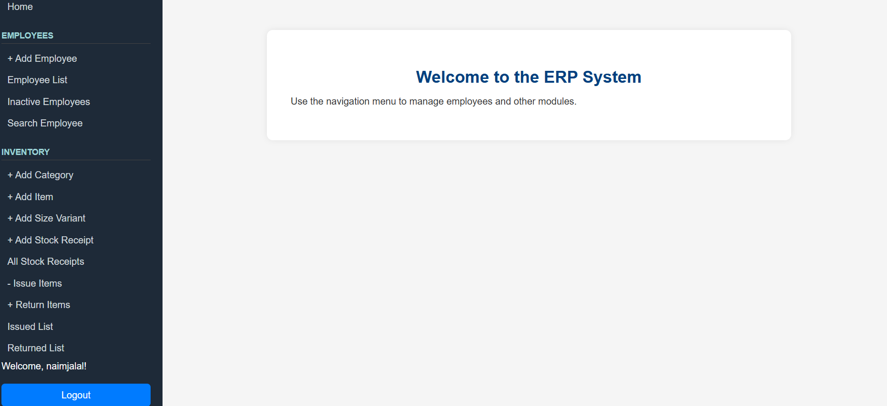
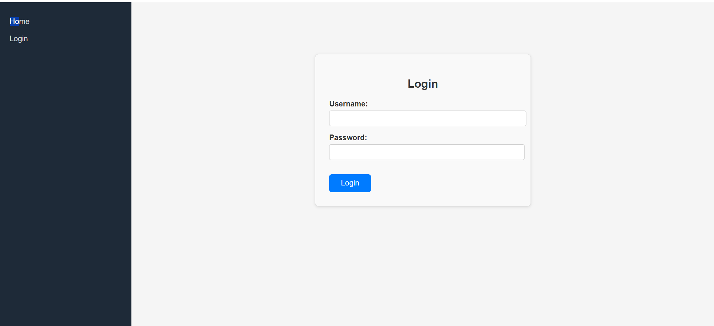
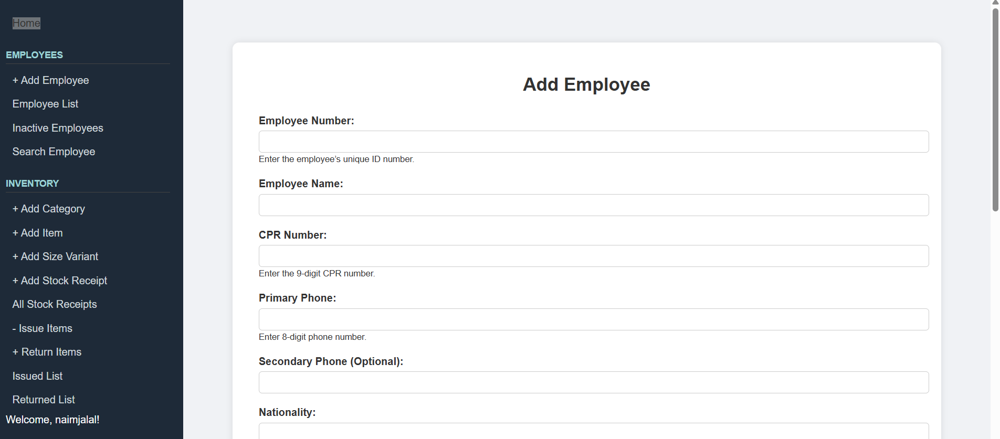
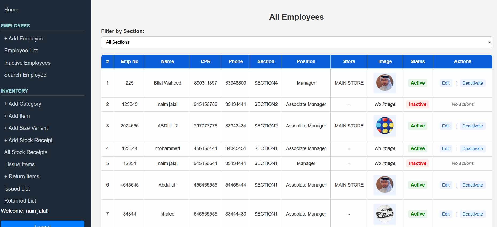
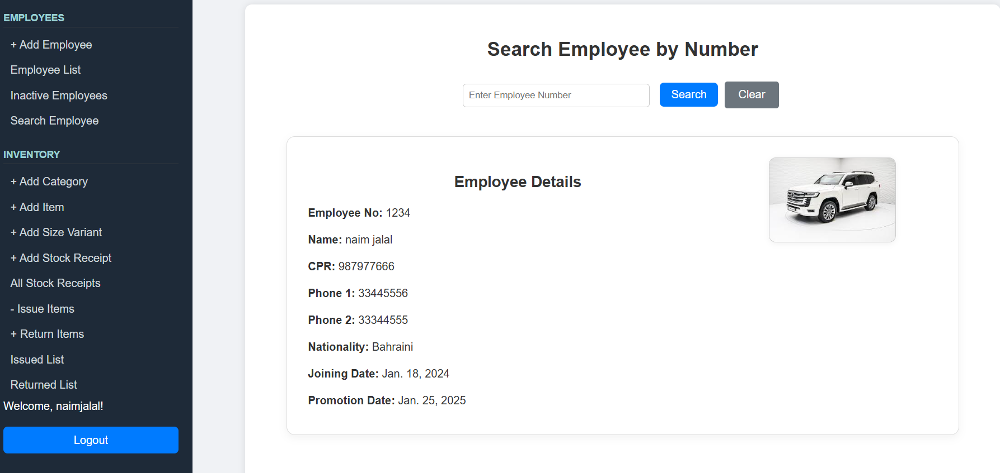
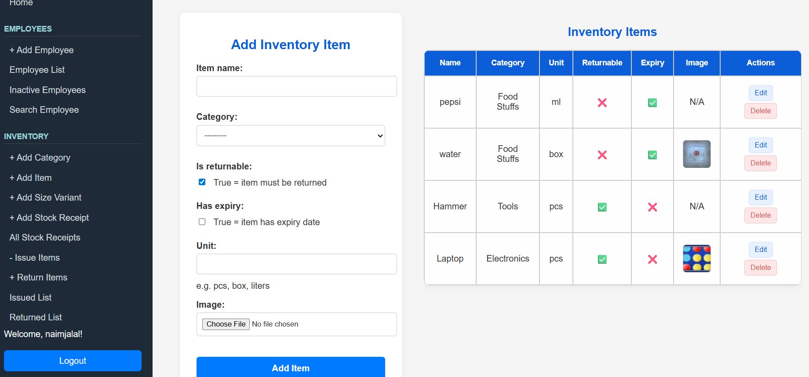
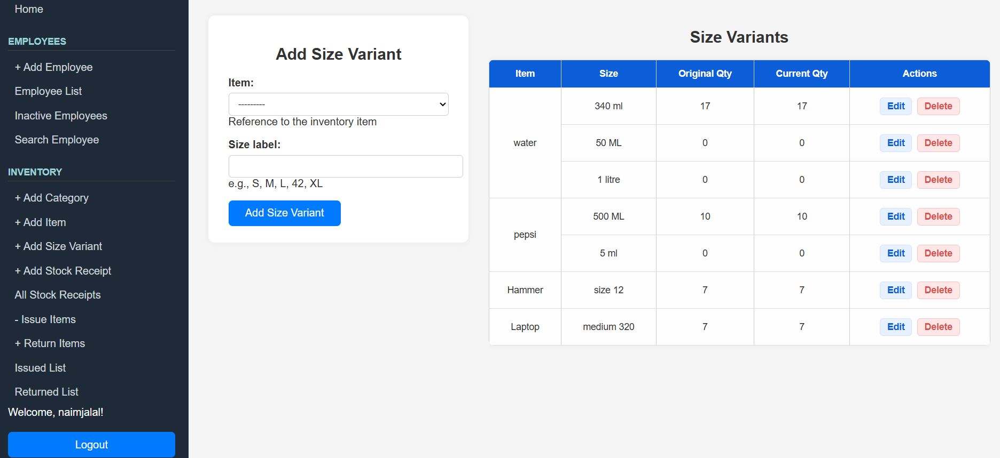
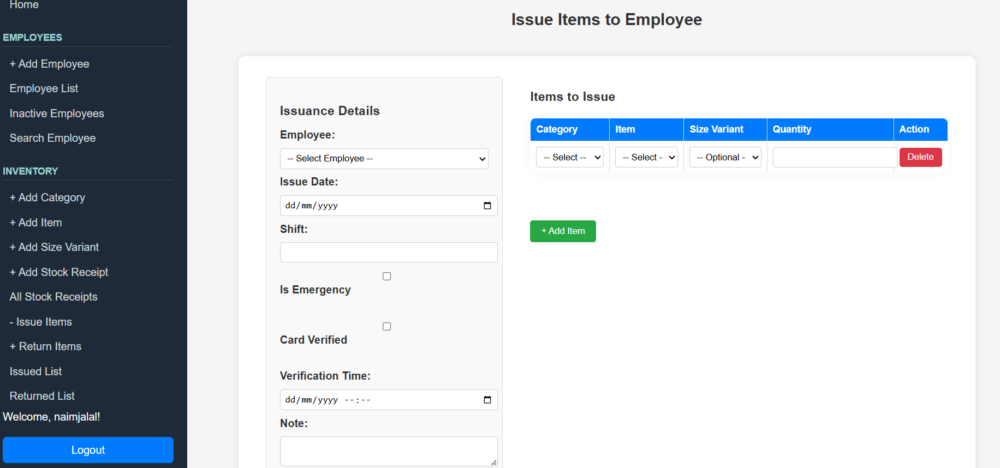
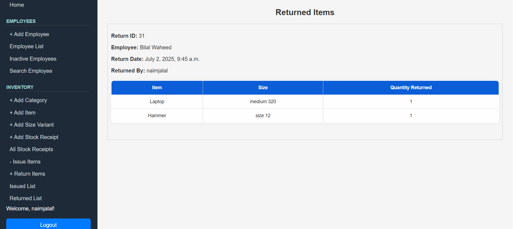

# InventoryERP

## Date: 03/07/2025

### By: Naim Jalal

#### [GitHub](https://github.com/naimjalal)

---

### **_Description_**

**InventoryERP** is a streamlined inventory and issuance management system designed for administrative and warehouse operations. It allows organizations to register items, manage stock receipts, track size variants, and handle item issuance and returns with accountability for each employee. The application is structured for professional environments with proper authentication and user roles.

---

### **_Technologies Used_**

- Python
- Django
- HTML / CSS / JavaScript
- PostgreSQL 

---

## **_Special Features_**

1. **Inventory Categories** — Group items by category (e.g. Stationery, Tools, Uniforms).
2. **Size Variants** — Manage item variations such as size, packaging, or quantity.
3. **Stock Receipt Module** — Record new item receipts with unit, expiry, and supplier.
4. **Item Issuance** — Assign items to employees with tracking by shift and emergency status.
5. **Return System** — Return items with logging, and auto-adjust inventory balance.
6. **Dynamic Forms** — Add/edit forms with JavaScript-powered filtering for category > item > size variant.
7. **Return History** — Track all return records with employee, returned by, and item breakdown.
8. **Role-based Authentication** — Admins can control access and manage users.
9. **Employee Management** — Register and manage employee records with section and designation.

---

### **_Key Pages_**

#### Home Page  

#### Login Page  

#### Add Employee Page  

#### Employee List Page  

#### Search Employee Page  

#### Add Inventory Page  

#### Size Variant Page  

#### Issue Page  

#### Return Item list Page  

---

### **_Future Updates_**

- [ ] Damage Tracking with Images
- [ ] Reports Module (PDF Export)
- [ ] Stock Level Alerts
- [ ] Scanning Employee card
- [x] ~~Return System~~
- [x] ~~Role-based Navigation~~

---

### **_ERD of the Project_**

- [dbdiagram.io](https://dbdiagram.io/d/Erp-System-6856edbff039ec6d3644d7f6)

### **_Trello Board_**

- [Trello](https://trello.com/b/U1B2aoz5/erp-system)

---

### **_Credits_**

- ChatGPT: [chat.openai.com](https://chat.openai.com)
- Django Docs: [docs.djangoproject.com](https://docs.djangoproject.com)

